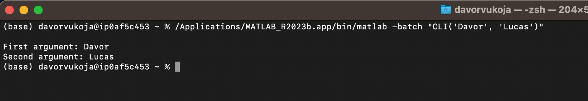
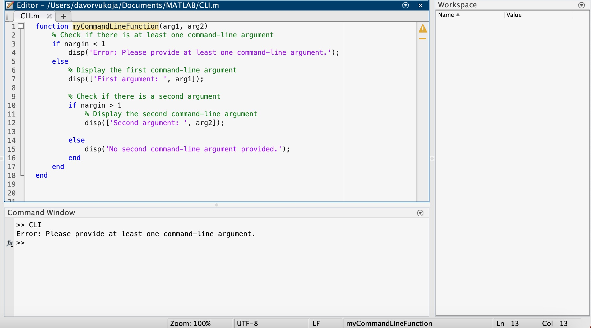

# CLI-dvukoja-lcbailey
This is for our CLI presentation
We are running this program on MacOS.

# Running the Program
To run the program, pass it two names in command line arguments. This is what we use in command line to call the code the .m file and pass in our arguments:
- /Applications/MATLAB_R2023b.app/bin/matlab -batch "CLI('Davor', 'Vukoja')"
This is how you can add user input from terminal
- /Applications/MATLAB_R2023b.app/bin/matlab -nodisplay -nodesktop -nosplash -r "run('user_name_greeting')"

To print the output to the console:
- disp(l['Second argument: ', arg1]);

The program will read in the arguments and then print information:

This is a picture of our code that makes the whole program work

